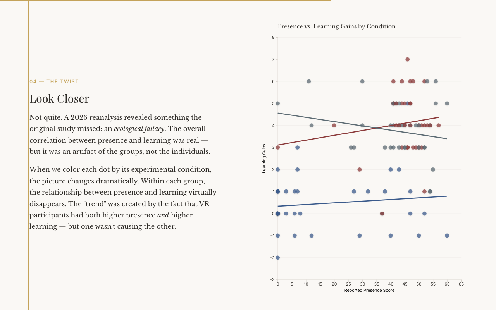

# Teaching Science Lab Safety: Are Virtual Simulations Effective?

An interactive data story exploring VR, learning, and a surprising statistical fallacy.



The 2018 PhD study (n=108) asked whether VR headsets improve learning. They don't. VR and desktop produced identical outcomes (Cohen's d = 0.23); both crushed passive instruction (d > 2.4). What mattered was the simulation, not the display. A 2026 reanalysis added something the original paper missed: the presence-learning correlation is an ecological fallacy — real at the group level, gone within each condition.

[**View the Interactive Story**](https://savvides.github.io/dissertation/)

## What You'll See

1. **The Experiment** — 108 participants randomly assigned to VR, desktop simulation, or video/text control
2. **The Promise** — Simulations work, but VR doesn't beat desktop
3. **The Deeper Question** — Presence as the theorized mechanism, with a convincing overall correlation
4. **The Twist** — The ecological fallacy reveal: color the dots by condition and the correlation disappears
5. **The Hidden Cost** — Cognitive load and the price of novelty
6. **The Evidence Lab** — An interactive scatter plot you can drive yourself: toggle overall vs. by-condition views, swap the y-axis between learning gains and cognitive load, and show or hide the regression lines to replay the fallacy on demand

## The Data

The study data is included for reproducibility:

- [`data.csv`](data.csv) — De-identified data for all 108 participants: learning gains, condition, presence scores, cognitive load
- [`litreview.csv`](litreview.csv) — 219 unique peer-reviewed papers (2019–2026) from an updated literature search

## How It Was Made

This entire site was built through conversation with [Claude Code](https://claude.ai/code). Read the full story: **[How It Was Made](HOW-IT-WAS-MADE.md)**

## Built With

- [D3.js](https://d3js.org/) v7 for data visualization
- Vanilla CSS with an editorial design system
- No build tools — static HTML that works from `file://`

<details>
<summary><strong>Full Academic Details</strong></summary>

## Abstract

108 participants were randomly assigned to one of three conditions: high immersion (VR headset simulation), medium immersion (desktop simulation), or low immersion (video and text). Participants completed a pretest, lab safety training, posttest, presence questionnaire, cognitive load questionnaire, and a one-week follow-up test.

**Key findings:**

- Participants in high and medium immersion conditions scored significantly higher on knowledge tests at posttest and follow-up than the low immersion group
- High and medium immersion groups reported significantly higher presence scores than the low immersion group
- Higher immersion and presence correlated with higher knowledge scores
- Presence was a significant predictor of posttest knowledge scores

## Study Overview

### Research Questions

This study addressed six research questions examining the relationship between immersion level and learning:

1. Do knowledge scores differ as a function of the different modes of immersion?
2. Is there a relationship between time of test and the level of immersion?
3. Does cognitive load (NASA Task Load Index) differ across immersion levels?
4. Does presence (Witmer & Singer questionnaire) differ across immersion levels?
5. Are there significant correlations between variables?
6. Can knowledge scores be predicted from the independent variables?

### Theoretical Framework

The study draws on four theoretical perspectives:

- **Embodied Cognition** — Human cognition is connected with bodily interactions in the physical environment; VR enables gestural, congruent learning interactions
- **Cognitive Load Theory** — Working memory is limited; VR's concrete, spatially integrated content was hypothesized to reduce extraneous load and maximize germane load
- **Constructivism & Problem-based Learning** — Learners construct knowledge through active, authentic problem-solving; VR simulations afford real-world scenario practice
- **Immersion & Presence** — Immersion (shutting out real-world cues) facilitates presence (the feeling of "being there"), which may enhance learning and engagement

### Design & Method

108 university students were randomly assigned to one of three conditions:

| Condition | Immersion Level | Medium | Content |
|-----------|----------------|--------|---------|
| High | VR headset | Lenovo Mirage Solo (standalone Daydream, WorldSense tracking) | Labster Lab Safety simulation |
| Medium | Desktop computer | Standard PC | Same Labster Lab Safety simulation |
| Low | Video + text | Standard PC | CrashCourse video + safety rules handout |

Participants completed a pretest, the intervention, a posttest, presence and cognitive load questionnaires, and a one-week follow-up test. Of the 108 participants, 92 completed the follow-up.

### Key Results

- **Knowledge**: High and medium immersion groups scored significantly higher at posttest (M = 9.03 and 9.34 vs. 6.13) and follow-up (M = 8.65 and 8.94 vs. 5.80) compared to low immersion. The interaction between immersion and time of test was significant, F(3.43, 154.14) = 42.77, p < .001, partial η² = .488.
- **Presence**: High and medium immersion groups reported significantly higher presence than low immersion (M = 46.26 and 46.22 vs. 11.24, p < .001). Notably, high and medium immersion presence scores were nearly identical — a surprising finding.
- **Cognitive Load**: No significant differences across conditions, F(2,104) = 2.28, p = .107, though the VR condition had the highest mean cognitive load (M = 2.85), possibly due to the novelty of the headset interface.
- **Prediction**: The original analysis found that presence significantly improved the prediction of posttest knowledge scores (R² change = .057, p < .001). However, a 2026 reanalysis revealed this relationship is driven entirely by between-group differences — see reanalysis below.

## Updated Literature Review (2019–2026)

The original dissertation's literature review cited sources through 2018. In 2026, an updated literature review was conducted to situate the study's findings within the current state of knowledge, covering seven years of rapid growth in VR education research — accelerated by the COVID-19 pandemic, advances in consumer VR hardware (Meta Quest, Apple Vision Pro), and a maturing theoretical understanding of immersive learning.

### Method

An AI-powered academic literature search was conducted using [Consensus](https://consensus.app), yielding 219 unique peer-reviewed papers (2019–2026). Of these, 43 were selected for the addendum based on evidence quality and relevance:

- 22 meta-analyses and 57 systematic reviews in the search pool
- 38 randomized controlled trials
- 185 papers from Q1 journals (SJR quartile)

### How New Evidence Aligns with the Study

The post-2018 literature broadly validates the study's findings while providing new theoretical frameworks for interpreting them:

- **The CAMIL Model** (Makransky & Petersen, 2021) offers a theoretical framework predicting that presence mediates between immersion and learning outcomes — consistent with the original analysis, but challenged by the 2026 reanalysis
- **"Platform is not destiny"** (Johnson-Glenberg et al., 2021) — the degree of embodied interaction matters more than display technology, directly explaining the VR-desktop equivalence
- **Novelty effects** (Miguel-Alonso et al., 2024) — VR novelty contributes to reduced learning during initial experiences, supporting the cognitive load interpretation
- **Interactive simulations consistently outperform passive instruction** across meta-analyses (Pellas et al., 2021; Villena-Taranilla et al., 2022; Matovu et al., 2022)

The full addendum with all citations is in [`dissertation.md`](dissertation.md#updated-literature-review-2019-2026).

## 2026 Retrospective

In 2026, I went back to the original data ([`data.csv`](data.csv)) and red-teamed the methodology with newer statistical tools. The headline finding holds: interactive simulations crushed passive instruction (Cohen's d > 2.4). The theoretical story about *why* doesn't:

- **Confounded conditions** — The low immersion group received fundamentally different content (video/text vs. interactive simulation), confounding immersion with interactivity
- **Uncontrolled time on task** — VR group spent ~10 more minutes than control (25.9 vs. 16.2 min)
- **Ceiling effect** — 69% of VR participants scored 9-10/10, compressing score differences
- **Ecological fallacy** — The overall presence-learning correlation (r = .506, p < .001) disappeared within conditions (High: r = .156, Medium: r = -.186, Low: r = .115 — all non-significant). The apparent relationship was an artifact of condition assignment.
- **Instrument validity** — The Witmer & Singer presence questionnaire was meaningless for video-watching participants (38% scored exactly zero)

</details>

## Citation

```
Savvides, P. (2018). Teaching Science Lab Safety: Are Virtual Simulations Effective?
(Doctoral dissertation, Arizona State University).
```

## Committee

- **Brian Nelson**, Chair
- **Mina Johnson-Glenberg**
- **Robert Atkinson**

## License

This work is licensed under [CC BY 4.0](https://creativecommons.org/licenses/by/4.0/). You are free to share and adapt this material with appropriate attribution.
